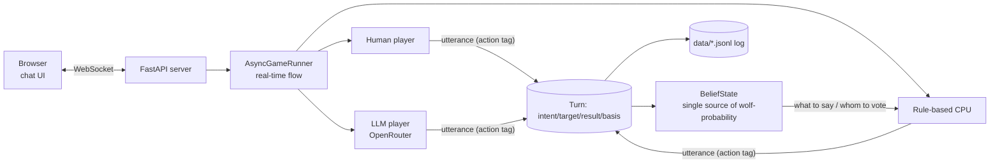

# Werewolf — real-time One Night Werewolf for humans, CPUs, and LLMs

[](https://github.com/Asumash/werewolf-simulation/actions/workflows/ci.yml)

📖 **日本語**: [README.md](README.md)

> A browser-based, real-time One Night Werewolf where **humans, rule-based AI, and
> large language models (LLMs)** play at the same table. Built as a research platform
> to observe and compare **how LLMs play a conversational, imperfect-information game**.

> 💡 **An OpenRouter API key is only needed to use LLMs. Everything runs with humans + CPUs without a key.**

---

## 🎯 Concept
A short, one-night werewolf game is the testbed. A **single shared interface** lets
humans, CPUs, and LLMs mix at one table. Every player's utterance is structured into a
common **action tag** `{intent, target, result, basis}` (suspect / seer result / vouch,
etc.), which the inference engine `BeliefState` interprets to act. Because all three are
handled by the same logic, you get both **mixed games** and **apples-to-apples comparison**.

## 🧭 Two ways to use it
- **Play**: real-time matches in the browser (humans + CPUs + LLMs). → *Setup*, *How to play*
- **Research**: run unattended batches, then record / analyze / evaluate human-likeness / train. → *Research workflow*

---

## 🚀 Setup
```bash
pip install -r requirements.txt          # required to run
pip install -r requirements-dev.txt      # for tests / dev tools
cp .env.example .env                      # Windows: copy .env.example .env
# Only if using LLMs: put your OpenRouter key in .env (OPENROUTER_API_KEY)
```

## 🎮 How to play (web)
```bash
python server.py
```
Open `http://<your-ip>:8000` shown at startup (others on the same Wi-Fi can join too).

1. Enter a name to create/join a room (up to 5 players; empty seats are auto-filled by AI)
2. The host chooses **how many of the AI seats are LLMs**, then starts
3. Night (seer / robber act) → Discussion (chat) → Vote
4. The village wins if a werewolf is among the executed

**Roles (5 players)**: Werewolf ×2, Seer, Robber, Villager ×3 (+2 in the "graveyard").
**Every match — including web games — is automatically logged to `data/`** (your research data).

---

## 🔬 Research workflow
"Run matches → record → analyze." See [dev/README.md](dev/README.md) for details.

### 1) Generate data (unattended batches)
```bash
python -m dev.batch_run --games 200                               # all-CPU (free)
python -m dev.batch_run --games 50 --llm 1 --out data/exp1/        # one LLM seat (needs key)
python -m dev.batch_run --games 50 --llm 2 --models "openai/gpt-4o-mini,openai/gpt-3.5-turbo"
```

### 2) Analyze (evaluation metrics)
```bash
python -m dev.analyze_games --dir data/exp1/     # current schema>=2 only (--all for everything)
```
→ Win rate, vote accuracy, **info-role claim-out (CO) rate**, and intent distribution,
broken down by **player type × role × model**.

### 3) Human-likeness (collect → evaluate → train)
```bash
# Collect: run `python server.py`, have humans play (logged as player_type=human)
python -m dev.turing_eval --limit 40                      # judge human/AI → human-likeness score
python -m dev.export_training --types human               # export SFT JSONL / few-shot examples
python -m dev.batch_run --llm 1 --fewshot data/train/fewshot_human.json  # inject human style
```

### 📋 Command cheat sheet
| Command | Purpose | API key |
|---|---|---|
| `python server.py` | Launch web matches | LLM seats only |
| `python smoke_llm.py` | LLM connectivity test (1 game) | required |
| `python -m dev.batch_run …` | Unattended batch / data generation | LLM seats only |
| `python -m dev.analyze_games …` | Aggregate evaluation metrics | not needed |
| `python -m dev.turing_eval …` | Human-likeness score | required |
| `python -m dev.export_training …` | Export training data | not needed |
| `pytest -q` | Tests | not needed |

---

## 🗂 Recording and data format
- Each match is saved to `data/game_<timestamp>_<id>.jsonl`, **one file per game** (`data/` is gitignored).
- Three record types per line:
  - `meta`: roles (dealt / after swap), graveyard, result, `players_meta` (**type human/cpu/llm, model**)
  - `statement`: utterance, **action tags** (intent/target/result/basis), reasoning, player_type, model, role
  - `vote`: voter and target
- `schema_version=2`. Analysis targets current (schema>=2) games by default.

## 🧩 Architecture


## ✨ Highlights
- **Three player types mix**: humans / rule-based AI / LLMs, in any combination
- **Real-time discussion**: event-driven, not fixed turns — AIs rebut when suspected, etc.
- **Inference core `BeliefState`**: a single decision engine updating wolf-probabilities per utterance
- **Common action language (tags)**: humans=buttons, CPU=templates, LLM=JSON, all emit the same tags
- **Human-likeness**: casual tone, per-player persona, and length-based "typing…" pacing for LLMs

## 🛠 Tech stack
| Area | Tech |
|---|---|
| Language | Python 3.8 |
| Server | FastAPI + WebSocket (uvicorn) |
| Frontend | Plain HTML/CSS/JavaScript (no framework) |
| LLM | OpenRouter (OpenAI-compatible API), called with the standard library only |

## 📁 Layout
```
engine/       game state & flow (sync / async runners)
players/      player implementations (rule-based CP, human, LLM)
prompts/      LLM prompts
recorder/     match logging
web/static/   frontend (chat UI)
tests/        pytest tests
dev/          research / analysis scripts (batch_run / analyze_games / turing_eval / export_training …)
server.py     web server (entry point)
smoke_llm.py  LLM connectivity test
data/         match logs (auto-generated, gitignored)
```

## ✅ Tests
Dealing, win determination, the inference engine (`BeliefState`), tag parsing, and full-game
completion are covered by pytest (run automatically in CI).
```bash
pytest -q
```

## 📝 Documentation
- [CPU_BEHAVIOR.md](CPU_BEHAVIOR.md) — rule-based AI decision-making in detail
- [RESULTS.md](RESULTS.md) — experimental results & current state (LLM behavior and interventions)
- [dev/README.md](dev/README.md) — research / analysis scripts

## 🔭 Roadmap
- Per-model LLM comparison; collecting human logs → Turing evaluation → training; richer reasoning

## 📄 Credits / License
Rules are an original implementation inspired by short-form (One Night) werewolf.
Individually developed (design & implementation).
