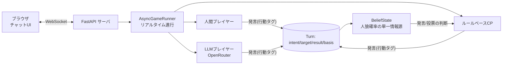

# 人狼ゲーム — 人間・CPU・LLM が同じ卓で遊べるリアルタイム人狼

> ブラウザ上で **人間・ルールベースAI・大規模言語モデル(LLM)** が入り混じって遊べる、
> リアルタイム対戦型の人狼ゲーム。
> 「AIは人狼をどこまで人間らしく遊べるか」を検証・比較することを目的に、
> 企画・設計・実装をすべて個人で開発しました。

<!-- ここにゲーム画面のスクリーンショット/GIF を貼る -->
<!-- 例:  -->

---

## 🎯 コンセプト
1晩で決着する短時間人狼を題材に、**同じ1つのインターフェース**で
人間プレイヤー・ルールベースCP・LLM を混在させられる対戦基盤を作りました。
全プレイヤーの発言は共通の「行動タグ（誰を疑う／占い結果／擁護 など）」に構造化され、
AIの推論エンジンがそれを解釈して立ち回ります。

## ✨ 主な特徴
- **3種のプレイヤーが混在**：人間 / ルールベースAI / LLM を任意の人数で同卓
- **リアルタイムの議論**：チャット形式。AIは固定順ではなく、疑われたら反論するなど
  イベント駆動で“会話の返し”が成立
- **AIの推論コア `BeliefState`**：発言が届くたびに各プレイヤーの人狼確率を増分更新する
  単一の意思決定エンジン。発言・投票の全判断がここを経由
- **共通の行動言語（タグ）**：人間はボタン、CPUは定型、LLMはJSONで、同じ
  `{intent, target, result, basis}` を出力 → 同一ロジックで処理・比較できる
- **人間らしさの追求**：LLMに砕けた口調・個体差ペルソナを与え、発話長に応じた
  「入力中…」の可変テンポで“人間の間合い”を再現

## 🛠 技術スタック
| 分類 | 使用技術 |
|---|---|
| 言語 | Python 3.8 |
| サーバ | FastAPI + WebSocket（uvicorn） |
| フロント | 素の HTML/CSS/JavaScript（フレームワーク非依存） |
| LLM連携 | OpenRouter（OpenAI互換API）を標準ライブラリのみで呼び出し |
| 設計 | イベント駆動の非同期処理、単一情報源(BeliefState)による意思決定 |

## 🧩 アーキテクチャ


## 🚀 セットアップと実行
```bash
pip install -r requirements.txt
cp .env.example .env        # Windows: copy .env.example .env
# LLMを使う場合のみ .env に OpenRouter の APIキーを記入
python server.py
```
起動時に表示される `http://<自分のIP>:8000` にブラウザでアクセス。
同じWi-Fi内なら他端末からも参加できます。

> **LLMキーが無くても遊べます**（LLM席は自動でCPUに置き換わります）。

## 🎮 遊び方
1. 名前を入れてルームを作成／参加（最大5人、足りない分はAIが自動参加）
2. ホストは **AI席のうちLLMの人数**を選択してゲーム開始
3. 夜フェーズで役職の行動（占い師・怪盗）→ 議論（チャット）→ 投票
4. 処刑された中に人狼がいれば村人陣営の勝ち

**役職構成（5人）**：人狼×2・占い師・怪盗・村人×3（＋墓地2枚）

## 📁 ディレクトリ構成
```
engine/       ゲーム状態と進行（同期/非同期ランナー）
players/      プレイヤー実装（ルールベースCP・人間・LLM）
prompts/      LLM用プロンプト
recorder/     対戦ログ記録
web/static/   フロントエンド（チャットUI）
dev/          開発・分析用スクリプト
server.py     Webサーバ（エントリポイント）
smoke_llm.py  LLM疎通テスト
```

## 📝 設計ドキュメント
- [GAME_SPEC.md](GAME_SPEC.md) … ゲーム仕様・ルール・数値設計
- [CPU_BEHAVIOR.md](CPU_BEHAVIOR.md) … AI（ルールベース）の意思決定の詳細と改善履歴
- [GAME_SPEC_EN.md](GAME_SPEC_EN.md) … 英語版仕様

## 💡 技術的に工夫した点
- **リアルタイム会話の実現**：固定ターン制をやめ、各AIが「話したい度」を随時
  評価して自律発話。LLMのAPI遅延はスレッドに逃がし、他プレイヤーを止めない
- **人間/CPU/LLMの統一**：行動を共通タグに構造化し、1つの推論エンジンで扱えるよう設計。
  LLMは「差し替え可能な戦略」として同じ継ぎ目に接続
- **意思決定の一本化と検証**：散在していた推論を `BeliefState` に統合。
  リファクタ前後で結果が完全一致することをテストで確認
- **役職バレの抑制**：発話タイミングを役職から切り離し、順番から役職が読まれない設計

## 🔭 今後の展望
- 複数LLMの**モデル別比較**（席ごとに別モデル）と勝率・人間らしさの可視化
- チューリングテストによる「人間らしさ」評価ループ
- 人間対戦ログを用いた学習

## 📄 クレジット / ライセンス
- ルールは短時間人狼（ワンナイト系）に着想を得たオリジナル実装です。
- 個人開発（企画・設計・実装）。
