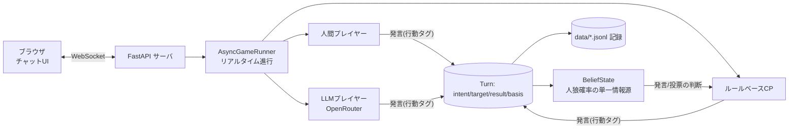

# 人狼ゲーム — 人間・CPU・LLM が同じ卓で遊べるリアルタイム人狼

[](https://github.com/Asumash/werewolf-simulation/actions/workflows/ci.yml)

> ブラウザ上で **人間・ルールベースAI・大規模言語モデル(LLM)** が入り混じって遊べる、
> リアルタイム対戦型の人狼ゲーム。「LLM が会話を伴う非完全情報ゲームをどうプレイするか」を
> 観察・比較するための研究基盤として、企画・設計・実装を個人で開発。

> 💡 **LLM を使う場合のみ OpenRouter の APIキーが必要です。無くても人間＋CPUで動作します。**

---

## 🎯 コンセプト
1晩で決着する短時間人狼を題材に、**同じ1つのインターフェース**で人間・CPU・LLM を
混在させられる対戦基盤。全プレイヤーの発言は共通の**行動タグ**
`{intent, target, result, basis}`（疑う／占い結果／擁護 など）に構造化され、
推論エンジン `BeliefState` がそれを解釈して立ち回る。三者を同一ロジックで扱えるため、
**混在対戦**も**同一条件での比較**もできる。

## 🧭 2つの使い方
- **遊ぶ**：ブラウザでリアルタイム対戦（人間＋CPU＋LLM）。→「セットアップ」「遊び方」
- **研究する**：無人でバッチ対戦を回し、記録・分析・人間らしさ評価・学習。→「研究ワークフロー」

---

## 🚀 セットアップ
```bash
pip install -r requirements.txt          # 実行に必要
pip install -r requirements-dev.txt      # テスト・開発ツールを使う場合
cp .env.example .env                      # Windows: copy .env.example .env
# LLM を使う場合のみ .env に OpenRouter の APIキーを記入（OPENROUTER_API_KEY）
```

## 🎮 遊び方（Web対戦）
```bash
python server.py
```
起動時に表示される `http://<自分のIP>:8000` にブラウザでアクセス（同じWi-Fi内なら他端末からも参加可）。

1. 名前を入れてルームを作成／参加（最大5人、足りない席はAIが自動参加）
2. ホストは **AI席のうちLLMの人数**を選んで開始
3. 夜（占い師・怪盗が行動）→ 議論（チャット）→ 投票
4. 処刑された中に人狼がいれば村人陣営の勝ち

**役職構成（5人）**：人狼×2・占い師・怪盗・村人×3（＋墓地2枚）。
Web対戦も含め、**全対戦は `data/` に自動記録**される（研究データになる）。

---

## 🔬 研究ワークフロー
「対戦を回す → 記録する → 指標で分析する」をコマンドで回せる。詳細は [dev/README.md](dev/README.md)。

### 1) データ生成（無人バッチ対戦）
```bash
python -m dev.batch_run --games 200                               # 全CPU（無料）
python -m dev.batch_run --games 50 --llm 1 --out data/exp1/        # LLM1体（要APIキー）
python -m dev.batch_run --games 50 --llm 2 --models "openai/gpt-4o-mini,openai/gpt-3.5-turbo"
```

### 2) 分析（評価指標）
```bash
python -m dev.analyze_games --dir data/exp1/     # 現行schema≥2のみ（--all で全体）
```
→ 勝率・投票精度・**情報役職のCO率**・intent分布を **種別 × 役職 × モデル**で集計。

### 3) 人間らしさ（収集 → 評価 → 学習）
```bash
# 収集: python server.py でWeb対戦を立て、人間に遊んでもらう（player_type=human で自動記録）
python -m dev.turing_eval --limit 40                      # 発言を人間/AI判定→人間らしさスコア
python -m dev.export_training --types human               # 学習用 SFT JSONL / few-shot例を出力
python -m dev.batch_run --llm 1 --fewshot data/train/fewshot_human.json  # 人間の口調を注入して対戦
```

### 📋 コマンド早見表
| コマンド | 用途 | APIキー |
|---|---|---|
| `python server.py` | Web対戦を起動 | LLM席のみ必要 |
| `python smoke_llm.py` | LLM疎通テスト（1ゲーム） | 必要 |
| `python -m dev.batch_run …` | 無人バッチ対戦・データ生成 | LLM席のみ |
| `python -m dev.analyze_games …` | 評価指標の集計 | 不要 |
| `python -m dev.turing_eval …` | 人間らしさスコア | 必要 |
| `python -m dev.export_training …` | 学習データ書き出し | 不要 |
| `pytest -q` | テスト | 不要 |

---

## 🗂 データの記録と形式
- 全対戦は `data/game_<日時>_<id>.jsonl` に **1ゲーム1ファイル**で保存（`data/` は `.gitignore`）。
- 各行は3種：
  - `meta`：役職（配布/交換後）・墓地・勝敗・`players_meta`（**種別 human/cpu/llm・モデル名**）
  - `statement`：発言・**行動タグ**（intent/target/result/basis）・reasoning・player_type・model・役職
  - `vote`：投票者・投票先
- `schema_version=2`。分析は既定で現行（schema≥2）のみを対象。

## 🧩 アーキテクチャ

```mermaid
flowchart LR
  B[ブラウザ<br/>チャットUI] <-- WebSocket --> S[FastAPI サーバ]
  S --> R[AsyncGameRunner<br/>リアルタイム進行]
  R --> H[人間プレイヤー]
  R --> C[ルールベースCP]
  R --> L[LLMプレイヤー<br/>OpenRouter]
  H & C & L -- 発言(行動タグ) --> T[(Turn: intent/target/result/basis)]
  T --> BS[BeliefState<br/>人狼確率の単一情報源]
  BS -- 発言/投票の判断 --> C
  T --> D[(data/*.jsonl 記録)]
```

## ✨ 主な特徴
- **3種のプレイヤーが混在**：人間 / ルールベースAI / LLM を任意の人数で同卓
- **リアルタイムの議論**：固定順でなく、疑われたら反論するなどイベント駆動で“会話の返し”
- **推論コア `BeliefState`**：発言ごとに人狼確率を増分更新する単一の意思決定エンジン
- **共通の行動言語（タグ）**：人間=ボタン／CPU=定型／LLM=JSON が同じタグを出力
- **人間らしさの追求**：LLMに砕けた口調・個体差・可変テンポ（「入力中…」）

## 🛠 技術スタック
| 分類 | 使用技術 |
|---|---|
| 言語 | Python 3.8 |
| サーバ | FastAPI + WebSocket（uvicorn） |
| フロント | 素の HTML/CSS/JavaScript（フレームワーク非依存） |
| LLM連携 | OpenRouter（OpenAI互換API）を標準ライブラリのみで呼び出し |

## 📁 ディレクトリ構成
```
engine/       ゲーム状態と進行（同期/非同期ランナー）
players/      プレイヤー実装（ルールベースCP・人間・LLM）
prompts/      LLM用プロンプト
recorder/     対戦ログ記録
web/static/   フロントエンド（チャットUI）
tests/        pytest テスト
dev/          研究・分析用スクリプト（batch_run / analyze_games / turing_eval / export_training …）
server.py     Webサーバ（エントリポイント）
smoke_llm.py  LLM疎通テスト
data/         対戦ログ（自動生成・.gitignore）
```

## ✅ テスト
配札・勝敗判定・推論エンジン(`BeliefState`)・タグ解析・対戦の完走を pytest で検証（CIで自動実行）。
```bash
pytest -q
```

## 📝 ドキュメント
- [CPU_BEHAVIOR.md](CPU_BEHAVIOR.md) … ルールベースAIの意思決定の詳細と設計
- [RESULTS.md](RESULTS.md) … 実験結果・研究の現状（LLMの振る舞いと介入の効果）
- [dev/README.md](dev/README.md) … 研究・分析スクリプトの一覧と使い方

## 🔭 今後の展望
- 複数LLMのモデル別比較、人間対戦ログの収集→チューリング評価→学習、推論の高度化

## 📄 クレジット / ライセンス
ルールは短時間人狼（ワンナイト系）に着想を得たオリジナル実装。個人開発（企画・設計・実装）。
